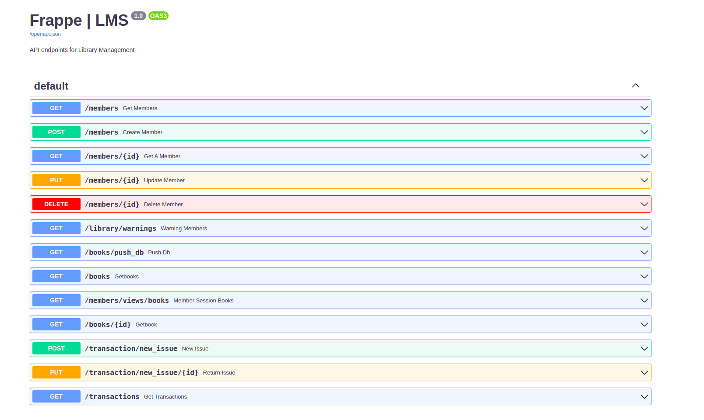
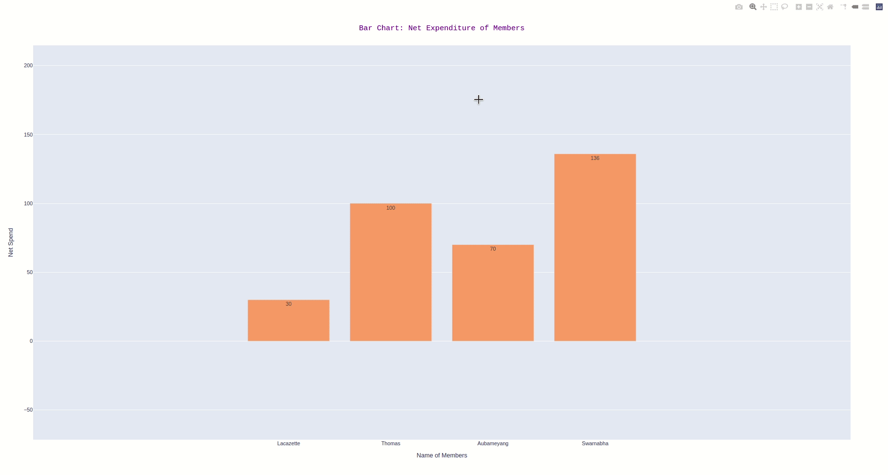

<div align="center"> 
  <p align='center'> 
   
   
   <br>
   
    <br>
   <br>
  </p>
  <br>
  <br>
  <p>
 <br>
   <br>
   <br><strong>Frappe-LMS</strong> is available under MIT License, read the LICENSE file for more info
  <p><br>
  <br>  
  <br> 
    
  <br>  
  <br>   
    
  <br>  
  <br>  
    
  <br>  
  <br>
    
  <br>  
  <br>
  <br><br>
  <br>
 </div>
 
  - **Fork** the Repository
  - Open your **Terminal / Cmd**
  
 <br>
 
   ```
   $ git clone https://github.com/sd2001/Frappe-LMS.git  
   ```   

   ```
   $ cd Frappe-LMS
   ```

   ```
   $ pip install virtualenv
   $ python -m venv <name of environment>
   $ source <name>/bin/activate
   $ pip install -r requirements.txt
   ```

   ```
   $ uvicorn main:app --reload
   
   OR
   
   $ bash run.sh 
   ```  
   
   <div align="center">
         
   </div><br>
